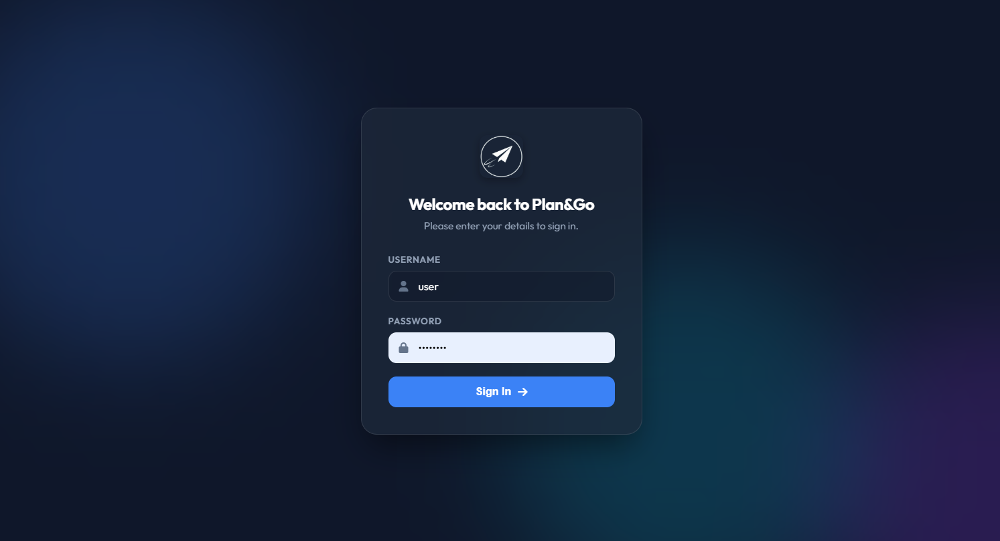
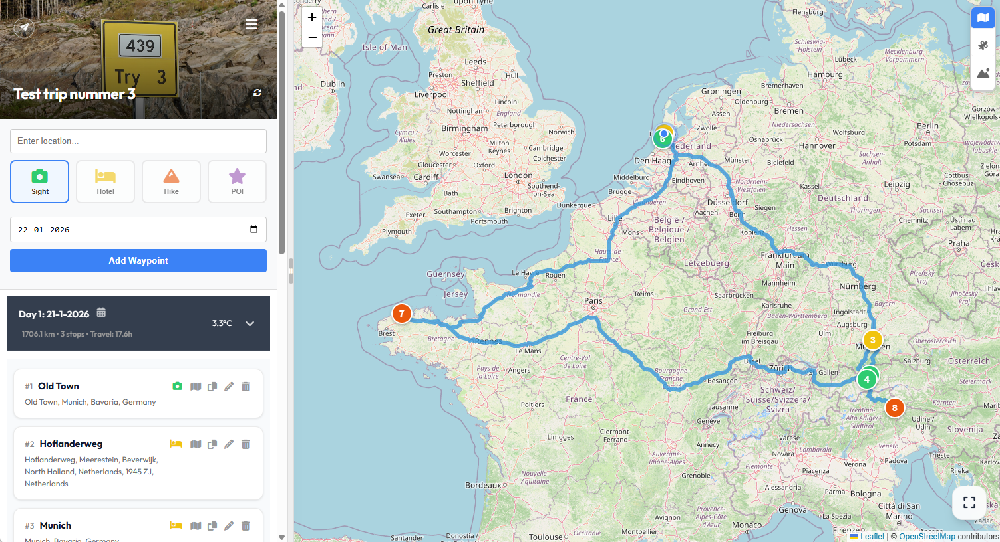
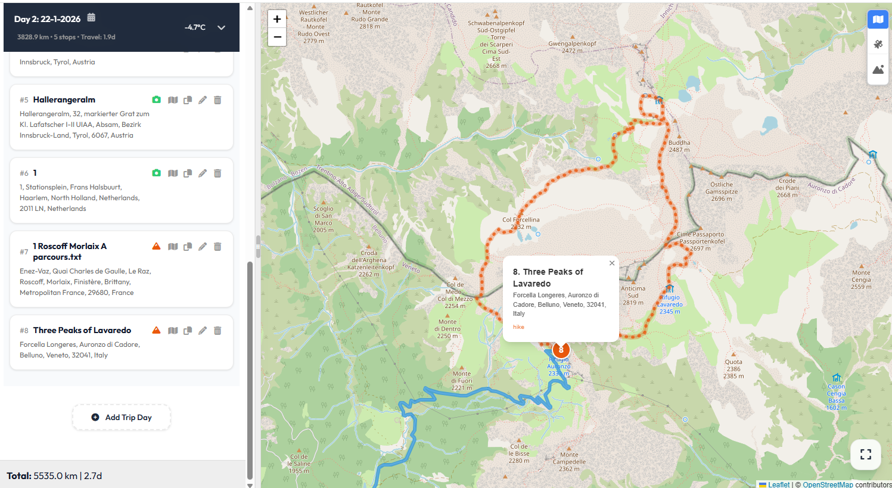
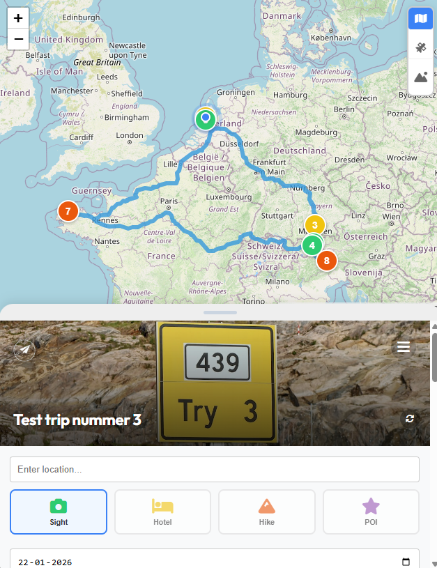

# 🌍 Plan&Go - Your Ultimate Trip Planner

<p align="center">
  
</p>

**Plan&Go** is a modern, lightweight, and powerful trip planning application designed for travelers, hikers, and explorers. Built with PHP and SQLite, it offers a seamless experience for organizing your next adventure, from weekend getaways to long-distance expeditions.

---

## ✨ Features

- **📍 Interactive Itinerary**: Add, remove, and reorder waypoints with ease using a drag-and-drop interface.
- **🗺️ Multiple Map Views**: Switch between Street, Satellite, and Terrain maps (Leaflet-powered).
- **🏷️ Intelligent Categorization**: Organize your stops as Sights, Hotels, Hikes, or Points of Interest (POI).
- **🥾 GPX Support**: Upload and visualize GPX tracks for your hiking and cycling adventures.
- **☁️ Dynamic Weather**: Real-time forecast and historical weather data for every stop on your journey.
- **🖼️ Beautiful Banners**: Automatic Unsplash integration that fetches stunning images based on your trip title.
- **📱 PWA Ready**: Install Plan&Go on your mobile device or desktop for a native app-like experience.
- **🔒 Secure Access**: Built-in authentication system with administrative user management.
- **📊 Detailed Audits**: Verify hotel stays and trip consistency with built-in auditing tools.

---

## 📸 Visual Overview

### 🔐 Secure Authentication

*A modern and sleek login interface ensuring your travel plans remain private and secure.*

### 🗺️ Comprehensive Route Planning

*Visualize your entire journey with an interactive map, detailed itinerary, and dynamic distance calculations.*

### 🥾 Advanced GPX Tracking

*Detailed trail visualization with terrain data and waypoint markers, perfect for hikers and outdoor enthusiasts.*

### 📱 Mobile-Optimized Experience

*Access and manage your trips on the go with a fully responsive and touch-friendly interface.*

---

## 🚀 Installation

### Prerequisites
- A web server (Apache, Nginx, etc.)
- PHP 7.4 or higher
- SQLite3 PHP extension enabled

### Setup Steps
1. **Clone/Upload**: Upload the project files to your web server's directory.
2. **Permissions**: Ensure the following items are writable by the web server (e.g., `www-data`):
   - `trips.db` (The database file)
   - `gpx/` (Directory for uploaded tracks)
   - `weatherAPI/cache/` (Weather data cache)
3. **Environment Config**: Create a `.env` file in the root directory (see [API Keys](#-api-keys)).
4. **First Launch**: Navigate to your site. On the first run, you will be prompted to create an administrator account.

---

## 🔑 API Keys

To unlock the full potential of Plan&Go, you'll need the following API key:

### Unsplash (Banners)
Used to automatically fetch high-quality background images for your trips.
1. Sign up at [Unsplash Developers](https://unsplash.com/developers).
2. Create a new application.
3. Copy your **Access Key**.
4. Add it to your `.env` file:
   ```env
   UNSPLASH_ACCESS_KEY=your_key_here
   ```

### Weather & Maps
Plan&Go uses **Open-Meteo** for weather and **OpenStreetMap** for mapping by default. Both are free to use and do not require an API key for standard usage.

---

## 🛠️ Development & Labs
Plan&Go includes a **Labs** dashboard (`labs.php`) for advanced users and developers. It provides tools for:
- Database diagnostics
- GPX file cleanup
- User management
- System audits (e.g., hotel stay verification)

---

<p align="center">
  Made with ❤️ for the global traveler.
</p>
